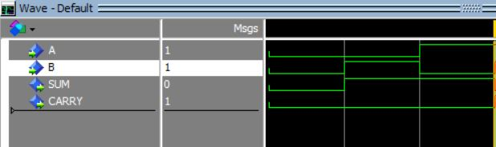

## Combinational Logic (조합논리회로)

조합논리회로는 논리곱(AND) 논리합(OR) 논리 부정(NOT) 세 가지의 기본 논리회로의 조합으로 만들어지며 입력신호, 논리게이트 및 출력신호로 구성된다. 논리게이트는 입력신호를 받아서 출력신호를 생성하며, 이 과정에서 2진 입력데이터를 조합하여 원하는 2진 출력데이터를 생성한다.

### Half Adder(반가산기)
  

반가산기는 한 자리 2진수 2개를 입력하여 합(sum : S), 캐리(carry : C)를 계산하는 덧셈 회로다. 위의 진리표와 같이 캐리 C는 입력 X, Y가 모두 1인 경우에만 1이 되고 합 S는 입력 X와 Y 둘 중 하나만 1일때 1이 된다.

#### Half Adder design with VHDL
```vhd
library ieee;
use ieee.std_logic_1164.all;

entity H_add is

	port(
		A, B : in std_logic;
		S, C : out std_logic);
end H_add;

architecture arch_H_add of H_add is
begin
	S <= A xor B;
	C <= A and B;

end arch_H_add;
```
#### testbench Half Adder
```vhd
library ieee;
use ieee.std_logic_1164.all;

entity tb_H_Add is
end tb_H_Add;

architecture tb_Half of tb_H_Add is

	component H_Add is
	port(
		A, B : in std_logic;
		S, C : out std_logic);
	end component;

	signal sig_A, sig_B, sig_S, sig_C : std_logic;

	begin
		ha_map : H_Add port map(sig_A, sig_B, sig_S, sig_C);

		HalfAdder : process begin
			sig_A <= '0';
			sig_B <= '0';
			wait for 20 ns;

			sig_A <= '0';
			sig_B <= '1';
			wait for 20 ns;

			sig_A <= '1';
			sig_B <= '0';
			wait for 20 ns;

			sig_A <= '1';
			sig_B <= '1';
			wait for 20 ns;
		end process;
end tb_Half;
```
#### Simulation Result for Half Adder


### FULL Adder(전가산기)
  

반가산기는 2진수 한자리 덧셈을 하므로 아랫자리에서 발생한 캐리를 고려하지 않기 때문에 2비트 이상인 2진수 덧셈은 할 수 없다. 이 캐리를 고려하여 만든 덧셈 회로가 전가산기다. 전가산기는 두 2진수 입력 X, Y0와 아랫자리로부터 올라온 캐리 $C_i$을 포함하여 한 자리 2진수 3개를 더하는 조합논리회로다.

#### FULL Adder design with VHDL
```vhd
library ieee;
use ieee.std_logic_1164.all;

entity F_Adder is

	port(
		A, B, Cin : in std_logic;
		S, Cout : out std_logic
	);
end F_Adder;

architecture arch_F_Adder of F_Adder is
begin
	S <= A xor B xor Cin;
	Cout <= (A and B) or ((A xor B) and Cin);
end arch_F_Adder;
```

#### testbench FULL Adder
```vhd
library ieee;
use ieee.std_logic_1164.all;

entity tb_F_Adder is
end tb_F_Adder;

architecture arch_Full_Adder of tb_F_Adder is

	component F_Adder is
	port(
		A, B, Cin : in std_logic;
		S, Cout : out std_logic
	);
	end component;

	signal sig_A, sig_B, sig_Cin, sig_S, sig_Cout : std_logic;

	begin
		FA_map : F_Adder port map(sig_A, sig_B, sig_Cin, sig_S, sig_Cout);

		Full_ADDER : process begin

			sig_A <= '0';
			sig_B <= '0';
			sig_Cin <= '0';
			wait for 20 ns;

			sig_A <= '0';
			sig_B <= '0';
			sig_Cin <= '1';
			wait for 20 ns;

			sig_A <= '0';
			sig_B <= '1';
			sig_Cin <= '0';
			wait for 20 ns;

			sig_A <= '0';
			sig_B <= '1';
			sig_Cin <= '1';
			wait for 20 ns;

			sig_A <= '1';
			sig_B <= '0';
			sig_Cin <= '0';
			wait for 20 ns;

			sig_A <= '1';
			sig_B <= '0';
			sig_Cin <= '1';
			wait for 20 ns;

			sig_A <= '1';
			sig_B <= '1';
			sig_Cin <= '0';
			wait for 20 ns;

			sig_A <= '1';
			sig_B <= '1';
			sig_Cin <= '1';
			wait for 20 ns;

		end process;
end arch_Full_Adder;		
```

#### Simulation Result for FULL Adder
  

### Decoder
n비트로 된 2진 코드는 서로다른 정보 $2^n$개를 표현할 수 있다.
디코더(decoder)는 입력선에 나타나는 n비트 2진 코드를 최대 $2^n$가지 정보로 바꿔주는 조합논리회로이다. enable단자가 있는 디코더와 각종 코드를 상호 변환하는 디코더도 있다.

### Encoder
인코더는 디코더의 반대 기능을 수행하는 조합논리회로로 신호 $2^n$개를 입력받아 출력신호 n개를 생성한다.

### Selecter(멀티플렉서, 디멀티플렉서)
멀티플렉서(Multiplexer)는 여러 입력선 중에서 하나를 선택하여 출력선에 연결하는 조합논리회로로 선택선의 값에 따라 한 입력선을 선택한다. 멀티플렉서는 많은 입력 중 하나를 선택하여 해당 입력선의 2진 정보를 출력선에 넘겨주기 때문에 데이터 선택기(Data Selector)라고도 한다.

디멀티플렉서는 멀티플렉서와 반대로 정보를 한 선으로 받아서 가능한 출력선 $2^n$개 중 하나를 선택하여 받은 정보를 전송하는 회로다.

멀티플렉서를 줄여서 MUX, 디멀티플렉서를 줄여서 DEMUX라고도 표현한다.
