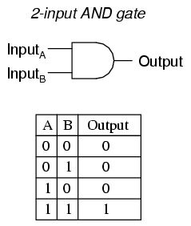

## Default Logic gate (기본 논리게이트 설명)
### AND gate

AND 게이트는 입력 2개 이상에 대하여 출력 1개를 얻는 게이트로 `논리 곱` 이라고 한다. 이 게이트의 출력은 입력에 따라 결정되는데, 입력이 모두 1(ON)인 경우에만 출력이 1(ON)이 되고 입력 중 0(OFF)이 하나라도 있으면 출력은 0(OFF)이 된다. 위의 그림은 2입력 AND 게이트의 논리 회로 기호와 진리표이다.  

AND 게이트의 출력에 대한 논리식은 F = XY로 나타낸다.

### OR gate

OR 게이트는 입력 2개 이상에 대해 출력 1개를 얻는 게이트로 `논리 합` 이라고 한다. 입력이 모두 0인 경우 출력이 0이 되며 입력중에 1이 하나라도 있으면 출력은 1이 된다. 위의 그림은 2 입력 OR 게이트의 논리회로 기호와 진리표이다.

OR 게이트의 출력에 대한 논리식은 F = X + Y로 나타낸다.

### XOR gate

XOR 게이트는 1이 홀수 개 입력된 경우 출력이 1이 되고 그렇지 않으면 출력이 0이 된다. 위의 그림은 2 입력 XOR 게이트의 논리 회로 기호와 진리표이다.

### NAND gate*

NAND 게이트는 입력 2개 이상에 대하여 출력 1개를 얻는 게이트로 입력이 모두 1인 경우에만 출력이 0이 되고 그렇지 않으면 출력은 1이 된다. 이 게이트는 AND 게이트와 반대로 작동하며 NOT - AND라는 의미로 NAND게이트라고 부른다. 뒤에서 설명할 NOR 게이트를 포함하여 두 게이트는 `UNIVERSAL GATE` 라고도 불리는데 두 가지의 회로로 모든 회로를 만들 수 있기 때문이다.

### NOR gate*

NOR 게이트는 입력 2개 이상에 대하여 출력 1개를 얻는 게이트로 입력이 모두 0인 경우에만 출력이 1이 되고 입력중에 1이 하나라도 있으면 출력은 0이 된다. 이 게이트는 OR 게이트와 반대로 작동하며 NOT - OR 라는 의미로 NOR 라고 부른다. 이 역시 NAND 게이트와 마찬가지로 `UNIVERSAL GATE` 라고도 불리며 모든 회로를 만들 수 있다.

### VHDL code
이제 위의 논리 회로들 VHDL로 구현해보고 Modelsim을 사용하여 Simulation 해보자. Modelsim은 학생요 PE version을 제공하니 반드시 PE 라이센스를 등록 후 사용하도록 하자.
##### default_gate.vhd
```vhd
library ieee;
use ieee.std_logic_1164.all;

entity default_gate is port(

	A, B : in std_logic;
	and_out, or_out, xor_out, nand_out, nor_out : out std_logic);
end default_gate;

architecture arch_default_gate of default_gate is
begin
	and_out <= A and B;
	or_out <= A or B;
	xor_out <= A xor B;
	nand_out <= A nand B;
	nor_out <= A nor B;

end arch_default_gate;
```
그리고 위의 코드를 시뮬레이션 하기 위한 testbench code가 필요하다.

##### tb_default_gate.vhd
```vhd
library ieee;
use ieee.std_logic_1164.all;

entity tb_default_gate is
end tb_default_gate;

architecture gate_tb of tb_default_gate is

	component default_gate is
	port(
		A, B : in std_logic;
		and_out, or_out, xor_out, nand_out, nor_out : out std_logic);
	end component;

	signal sig_A, sig_B, sig_and, sig_or, sig_xor, sig_nand, sig_nor : std_logic;

	begin
		gate_map : default_gate port map(sig_A, sig_B, sig_and, sig_or, sig_xor, sig_nand, sig_nor);

		W_DATA : process begin

			sig_A <= '0';
			sig_B <= '0';
			wait for 20 ns;

			sig_A <= '0';
			sig_B <= '1';
			wait for 20 ns;

			sig_A <= '1';
			sig_B <= '0';
			wait for 20 ns;

			sig_A <= '1';
			sig_B <= '1';
			wait for 20 ns;
		end process;
end gate_tb;
```

Modelsim을 사용하여 TB를 시뮬레이팅을 하면 아래와 같은 결과를 볼 수 있다.


